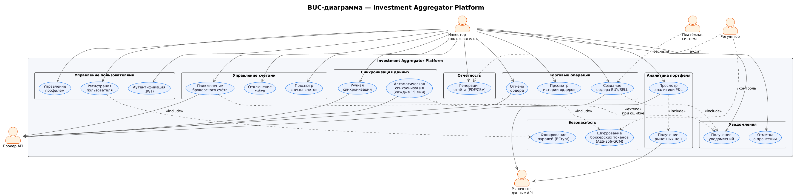

# BUC-диаграмма (бизнес-процессы)

## Матрица стейкхолдеров

| Стейкхолдер | Роль/Влияние | Интересы | Влияние (1-5) | Стратегия |
|---|---|---|---|---|
| Пользователь (инвестор) | Конечный пользователь | Удобство, безопасность, полная аналитика | 5 | UX-исследования, сбор фидбека |
| Брокеры | Партнёры / поставщики данных | Корректная интеграция, безопасность API | 5 | Партнёрские соглашения, API-интеграции |
| Команда разработки | Исполнители | Чёткие требования, стабильная архитектура | 4 | Agile, регулярные синки |
| Регуляторы | Контролирующий орган | Соответствие законодательству | 4 | Соблюдение требований, юридический аудит |
| Платёжные системы | Внешние сервисы | Надёжность интеграции, безопасность | 3 | Интеграция по стандартам, SLA |
| Инвесторы / заказчики | Финансирование и стратегия | ROI, рост продукта | 5 | Отчётность, демо, метрики |

## SWOT-анализ

### Сильные стороны
- Уникальная ценность: единый интерфейс для всех брокеров
- Возможность глубокой аналитики портфеля
- Масштабируемая IT-архитектура (PCMEF)

### Слабые стороны
- Зависимость от API брокеров
- Сложность интеграции с разными системами
- Высокие требования к безопасности данных

### Возможности
- Рост числа частных инвесторов
- Развитие Open API и финтех-инфраструктуры
- Спрос на автоматизацию и инвестиционную аналитику

### Угрозы
- Конкуренция со стороны крупных брокеров и финтех-сервисов
- Изменения в регулировании финансового рынка
- Ограничение доступа к данным со стороны брокеров

## Экономическое обоснование

| Показатель | Значение |
|---|---|
| Текущие затраты (без системы) | 600 000 руб/год |
| Затраты после внедрения | 596 000 руб/год |
| Дополнительные выгоды | 400 000 руб/год |
| Общая выгода | 404 000 руб/год |
| Инвестиции в разработку | 1 800 000 руб |
| Срок окупаемости | ~53 месяца |
