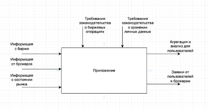

# Контекстная диаграмма (IDEF0)

## Основная функция системы

Агрегировать инвестиционные счета из нескольких брокеров в единый интерфейс.

## Входные потоки

- Данные о счетах и балансах от брокеров
- История операций и сделок
- Рыночные данные по ценным бумагам
- Пользовательские настройки и цели инвестирования

## Выходные потоки

- Сводная аналитика по всем счетам
- Рекомендации по управлению активами
- Уведомления и отчёты
- Торговые заявки, отправленные брокерам

## Управляющие факторы

- Требования безопасности и защиты данных
- Ограничения API брокеров
- Регуляторные нормы финансового рынка

## Исполнители

- Программная система (backend + mobile frontend)
- API брокеров и внешние сервисы рыночных данных
- Пользователь (инвестор)
