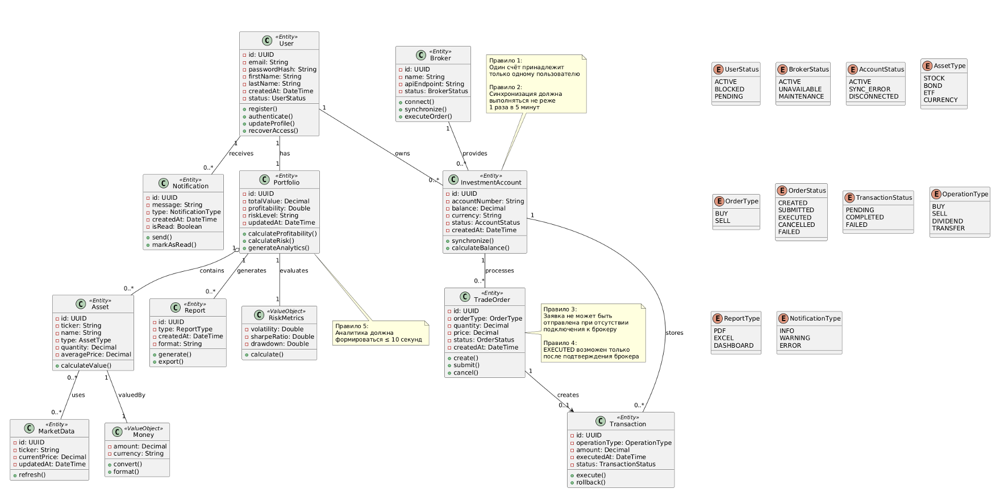

# Модель предметной области (Domain Model)

## Сущности и их атрибуты

### User
| Атрибут | Тип | Ограничения |
|---|---|---|
| id | UUID | PK |
| email | String | UNIQUE, NOT NULL |
| password | String | NOT NULL (BCrypt hash) |
| createdAt | OffsetDateTime | NOT NULL |
| deletedAt | OffsetDateTime | Nullable (soft delete) |

### Broker
| Атрибут | Тип | Ограничения |
|---|---|---|
| id | UUID | PK |
| name | String | UNIQUE, NOT NULL |
| apiBase | String | NOT NULL |
| isActive | boolean | NOT NULL, default true |
| createdAt | OffsetDateTime | NOT NULL |

### InvestmentAccount
| Атрибут | Тип | Ограничения |
|---|---|---|
| id | UUID | PK |
| user_id | UUID | FK -> users |
| broker_id | UUID | FK -> broker |
| accountNumber | String | NOT NULL |
| brokerToken | String (TEXT) | NOT NULL, AES-256-GCM |
| accountStatus | AccountStatus | NOT NULL, default ACTIVE |
| syncedAt | OffsetDateTime | Nullable |
| deletedAt | OffsetDateTime | Nullable (soft delete) |

### Portfolio
| Атрибут | Тип | Ограничения |
|---|---|---|
| id | UUID | PK |
| user_id | UUID | FK -> users, UNIQUE (1:1) |
| currency | String(3) | default "RUB" |
| createdAt | OffsetDateTime | NOT NULL |

### Asset
| Атрибут | Тип | Ограничения |
|---|---|---|
| id | UUID | PK |
| portfolio_id | UUID | FK -> portfolio |
| ticker | String(20) | NOT NULL |
| name | String(255) | Nullable |
| qty | BigDecimal(18,6) | NOT NULL |
| avgPrice | BigDecimal(18,6) | NOT NULL |
| currency | String(3) | default "RUB" |

### TradeOrder
| Атрибут | Тип | Ограничения |
|---|---|---|
| id | UUID | PK |
| account_id | UUID | FK -> investment_account |
| ticker | String(20) | NOT NULL |
| direction | OrderDirection | BUY / SELL |
| qty | BigDecimal(18,6) | NOT NULL |
| price | BigDecimal(18,6) | NOT NULL |
| orderStatus | OrderStatus | default PENDING |
| brokerOrderId | String | Nullable |
| placedAt | OffsetDateTime | NOT NULL |
| filledAt | OffsetDateTime | Nullable |
| deletedAt | OffsetDateTime | Nullable (soft delete) |

### Transaction
| Атрибут | Тип | Ограничения |
|---|---|---|
| id | UUID | PK |
| account_id | UUID | FK -> investment_account |
| order_id | UUID | FK -> trade_order, Nullable |
| transactionType | TransactionType | NOT NULL |
| amount | BigDecimal(18,6) | NOT NULL |
| currency | String(3) | default "RUB" |
| occurredAt | OffsetDateTime | NOT NULL |
| deletedAt | OffsetDateTime | Nullable (soft delete) |

### MarketData, Notification, Report
Описаны в глоссарии (docs/01-business-model/glossary.md).

## Отношения

| Сущность 1 | Отношение | Сущность 2 | Кратность |
|---|---|---|---|
| User | владеет | InvestmentAccount | 1 : 0..* |
| Broker | предоставляет | InvestmentAccount | 1 : 0..* |
| User | имеет | Portfolio | 1 : 1 |
| Portfolio | содержит | Asset | 1 : 0..* |
| InvestmentAccount | хранит | Transaction | 1 : 0..* |
| InvestmentAccount | обрабатывает | TradeOrder | 1 : 0..* |
| TradeOrder | создает | Transaction | 1 : 0..1 |
| Portfolio | генерирует | Report | 1 : 0..* |
| User | получает | Notification | 1 : 0..* |
