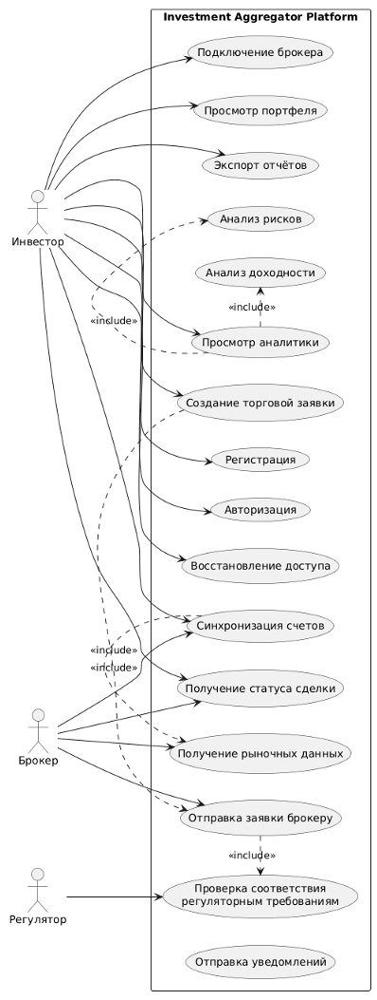

# Диаграмма вариантов использования (Use-Case Diagram)

## Акторы

| Актор | Описание |
|---|---|
| Инвестор | Конечный пользователь, управляющий портфелем |
| Брокер API | Внешняя система — API брокера |
| Система (Scheduler) | Внутренний планировщик автосинхронизации |

## Прецеденты

| ID | Название | Актор | Приоритет |
|---|---|---|---|
| UC-001 | Регистрация пользователя | Инвестор | Высокий |
| UC-002 | Подключение брокерского счёта | Инвестор, Брокер API | Высокий |
| UC-003 | Просмотр аналитики портфеля | Инвестор | Высокий |
| UC-004 | Создание торговой заявки | Инвестор, Брокер API | Высокий |
| UC-005 | Синхронизация данных брокера | Система, Инвестор | Средний |
| UC-006 | Генерация отчёта | Инвестор | Средний |
| UC-007 | Уведомления | Система | Средний |

## Связи Use Case — Сервис — Зависимость

| Use Case | Ключевой сервис | Внешняя зависимость |
|---|---|---|
| UC-001 | UserService | -- |
| UC-002 | AccountService | BrokerClient (валидация) |
| UC-003 | AnalyticsService | MarketClient |
| UC-004 | OrderService | BrokerClient |
| UC-005 | SyncService | BrokerClient |
| UC-006 | ReportService | -- |
| UC-007 | NotificationService | FCM (опционально) |
