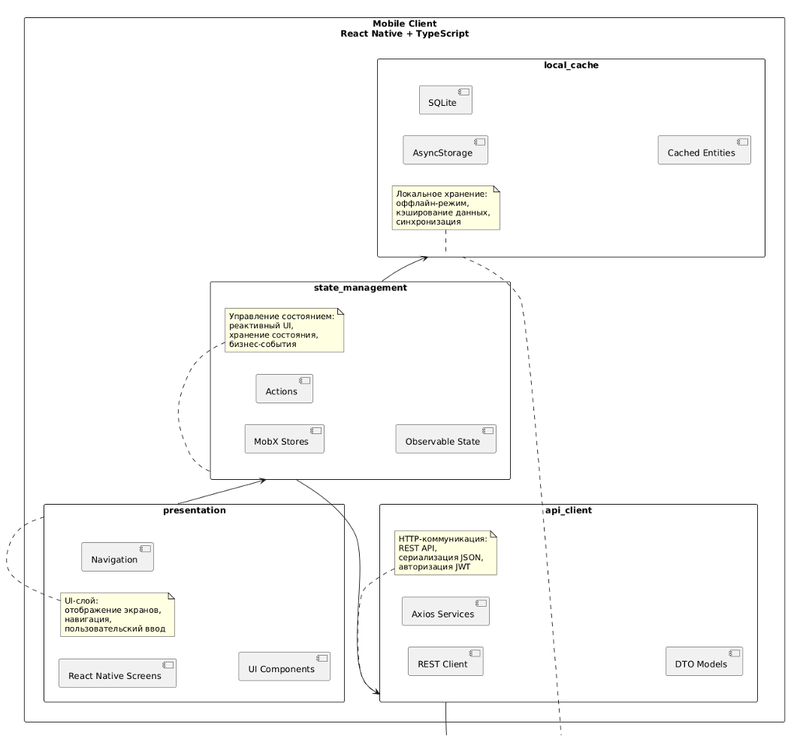
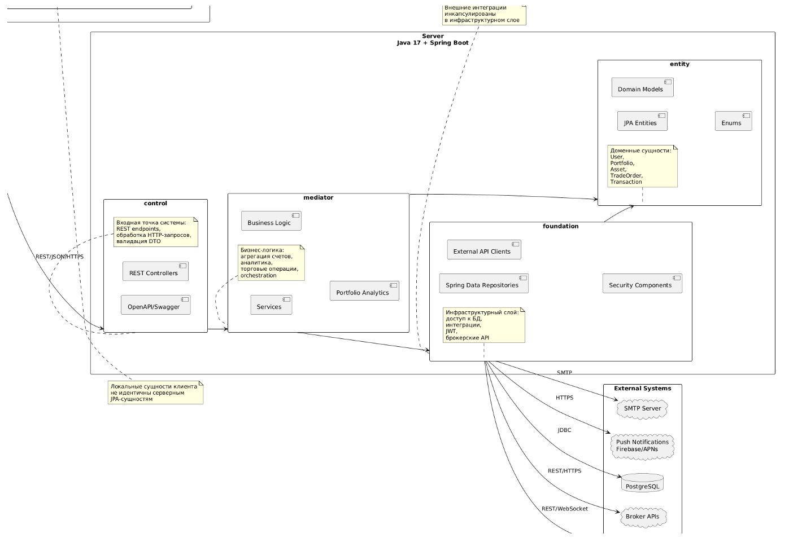

# PCMEF-диаграмма




## Распределённая архитектура

```
[Mobile Client]                         [Backend Server]
Presentation (screens/)
  |
  v
State (stores/)          --HTTP/JSON-->  Control (controller/)
  |                                        |
  v                                        v
API Client (api/)                       Mediator (service/)
  |                                        |
  v                                        v
Local Cache (AsyncStorage)              Entity (entity/)
                                           |
                                           v
                                        Foundation (repository/, client/)
                                           |
                                           v
                                        [PostgreSQL]  [Broker APIs]  [Market APIs]
```

## Направление зависимостей (строго сверху вниз)

```
Presentation -> State -> API Client -> Control -> Mediator -> Entity -> Foundation
```

Обратные зависимости запрещены.

## Слои и ответственность

### Клиент (React Native + TypeScript)

| Слой | Каталог | Ответственность | Запрещено |
|---|---|---|---|
| Presentation | `screens/`, `components/` | UI, навигация, отображение | Бизнес-логика, прямые API-вызовы |
| State | `stores/` | MobX-хранилища, реактивное состояние | Обращение к репозиториям |
| API Client | `api/` | HTTP-вызовы, Bearer-заголовок, парсинг ошибок | Бизнес-логика |

### Сервер (Spring Boot)

| Слой | Каталог | Ответственность | Запрещено |
|---|---|---|---|
| Control | `controller/` | REST-эндпоинты, валидация, маппинг DTO | Бизнес-логика, прямой доступ к БД |
| Mediator | `service/` | Бизнес-правила, оркестрация, расчёты | Возврат Entity, прямой доступ к БД |
| Entity | `entity/` | JPA-маппинг, доменные объекты | Импорт сервисов |
| Foundation | `repository/`, `client/` | Доступ к БД, внешние API | Бизнес-правила |

## Примеры запрещённых вызовов

| Запрещённый вызов | Правильная альтернатива |
|---|---|
| Controller -> Repository | Controller -> Service -> Repository |
| Entity imports Service | Service reads Entity |
| Component calls Axios | Component -> Store -> API Client -> Axios |
| Service returns Entity | Service maps Entity -> DTO, returns DTO |
