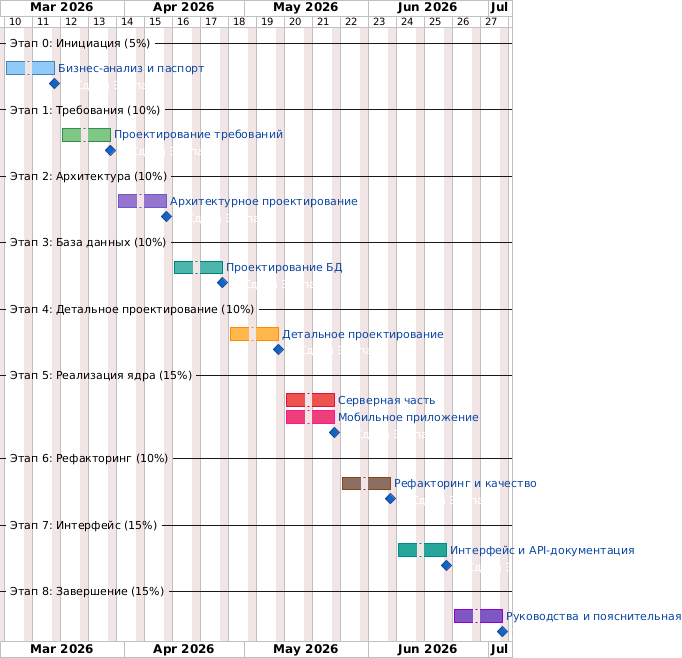

# Диаграмма Ганта

## Диаграмма



---

## Календарный план (18 недель)

| Этап | Недели | Период | Трудоёмкость |
|---|---|---|---|
| Этап 0: Инициация и бизнес-анализ | 1–2 | 01.03 – 14.03.2026 | 23 ч |
| Этап 1: Проектирование требований | 3–4 | 15.03 – 28.03.2026 | 18 ч |
| Этап 2: Архитектурное проектирование | 5–6 | 29.03 – 11.04.2026 | 16 ч |
| Этап 3: Проектирование БД | 7–8 | 12.04 – 25.04.2026 | 9 ч |
| Этап 4: Детальное проектирование | 9–10 | 26.04 – 09.05.2026 | 15 ч |
| Этап 5: Реализация ядра | 11–12 | 10.05 – 23.05.2026 | 82 ч |
| Этап 6: Рефакторинг и тестирование | 13–14 | 24.05 – 06.06.2026 | 13 ч |
| Этап 7: Мобильный интерфейс | 15–16 | 07.06 – 20.06.2026 | 30 ч |
| Этап 8: Завершение и документация | 17–18 | 21.06 – 04.07.2026 | 23 ч |

---

## Текстовая диаграмма Ганта

```
Этап                     | Нед: 1  2  3  4  5  6  7  8  9  10 11 12 13 14 15 16 17 18
-------------------------+-----------------------------------------------------------
0: Инициация             |      ████
1: Требования            |            ████
2: Архитектура           |                  ████
3: Проектирование БД     |                        ████
4: Детальное проект.     |                              ████
5: Реализация ядра       |                                    ████
6: Рефакторинг + тесты  |                                          ████
7: Мобильный интерфейс   |                                                ████
8: Завершение            |                                                      ████
```

---

## Описание этапов

### Этап 0: Инициация и бизнес-анализ (23 ч)
- Описание предметной области (агрегация брокерских счетов)
- Контекстная диаграмма IDEF0, BUC-диаграмма
- SWOT-анализ, матрица стейкхолдеров
- Экономическое обоснование (ROI, окупаемость)
- Глоссарий предметной области

### Этап 1: Проектирование требований (18 ч)
- Диаграмма вариантов использования (UC-001 — UC-004)
- Спецификации прецедентов (основные потоки, исключения)
- Модель предметной области (Domain Model)
- Таблицы трассировки сущностей

### Этап 2: Архитектурное проектирование (16 ч)
- Выбор и обоснование архитектуры PCMEF
- Диаграммы пакетов (фронт + бэк)
- Диаграмма зависимостей
- Технологический стек (Java 17, Spring Boot 3.5, React Native, MobX, PostgreSQL)
- Анализ альтернатив (MVC, Clean Architecture)

### Этап 3: Проектирование БД (9 ч)
- ER-диаграмма (10 таблиц, 10 связей)
- DDL-скрипты, Flyway-миграции V1–V10
- Индексы, ограничения целостности
- Стратегия soft delete для финансовых сущностей

### Этап 4: Детальное проектирование (15 ч)
- Диаграммы последовательностей SF-01 — SF-06
- Таблицы анализа классов и методов (UC-001 — UC-004)
- Описание паттернов (Front Controller, Service Layer, Repository, DTO, Strategy, Observer)

### Этап 5: Реализация ядра (82 ч)
- 10 JPA-сущностей, 7 enum-типов
- 10 репозиториев, 2 внешних клиента (BrokerClient, MarketClient)
- JWT-аутентификация (HMAC-SHA256), BCrypt, AES-256-GCM
- 8 сервисов бизнес-логики (UserService, AuthService, AccountService, AnalyticsService, OrderService, SyncService, ReportService, NotificationService)
- 7 REST-контроллеров, OpenAPI/Swagger
- Docker Compose (PostgreSQL + pgAdmin)
- Миграции V11 (seed-брокеры), V12 (schema fix), V13 (демо-данные)

### Этап 6: Рефакторинг и тестирование (13 ч)
- PCMEF-ревью (устранение нарушения в SyncController)
- Оптимизация N+1 в SyncScheduler
- 40 тестов: 18 unit (JUnit 5 + Mockito), 2 интеграционных (@DataJpaTest), 16 контроллерных (@WebMvcTest)
- JaCoCo — покрытие кода

### Этап 7: Мобильный интерфейс (30 ч)
- 8 экранов: Login, Register, Portfolio, Orders, Accounts, ConnectBroker, TradeOrderForm, Notifications
- 5 MobX-хранилищ (userStore, portfolioStore, accountStore, orderStore, notificationStore)
- 7 API-модулей (Axios + Bearer interceptor)
- Навигация: RootNavigator, AuthStack, MainTabs
- 3 компонента (LoadingSpinner, ErrorMessage, AssetCard)

### Этап 8: Завершение и документация (23 ч)
- Скрипты start.sh / stop.sh
- README, пояснительная записка
- Папка docs/ (8 разделов)
- ER-диаграмма (PlantUML)
- Листинги кода (backend + mobile)
- Презентация (26 слайдов)

---

## Контрольные точки (Milestones)

| Дата | Контрольная точка |
|---|---|
| 14.03.2026 | Сдача Этапа 0: паспорт проекта, IDEF0, BUC, SWOT, глоссарий |
| 28.03.2026 | Сдача Этапа 1: Use Case UC-001–UC-004, Domain Model, спецификации прецедентов |
| 11.04.2026 | Сдача Этапа 2: PCMEF-диаграммы (фронт + бэк), обоснование архитектуры |
| 25.04.2026 | Сдача Этапа 3: ER-диаграмма, DDL-скрипты, Flyway V1–V10 |
| 09.05.2026 | Сдача Этапа 4: диаграммы последовательностей SF-01–SF-06, анализ классов |
| 23.05.2026 | Сдача Этапа 5: работающий backend + REST API + Swagger + Docker |
| 06.06.2026 | Сдача Этапа 6: 40 тестов (100% pass), JaCoCo, рефакторинг |
| 20.06.2026 | Сдача Этапа 7: мобильное приложение (8 экранов), полная навигация |
| 04.07.2026 | **Финальная защита**: пояснительная записка, презентация, демо |
